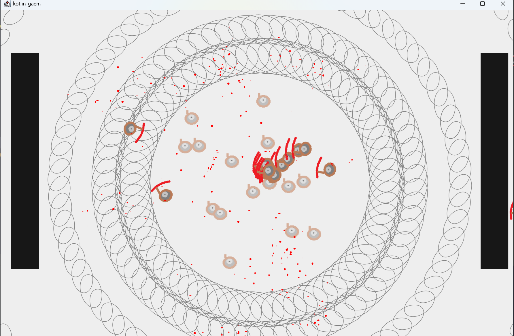

# KotlineMiami
Quick Kotlin game to test the language, vaguely inspired by Hotline Miami

A swirling dance floor, masses of enemies and high paced action.

## How to
* `gradlew run` to run
* WASD to move
* Mouse to aim and shoot
